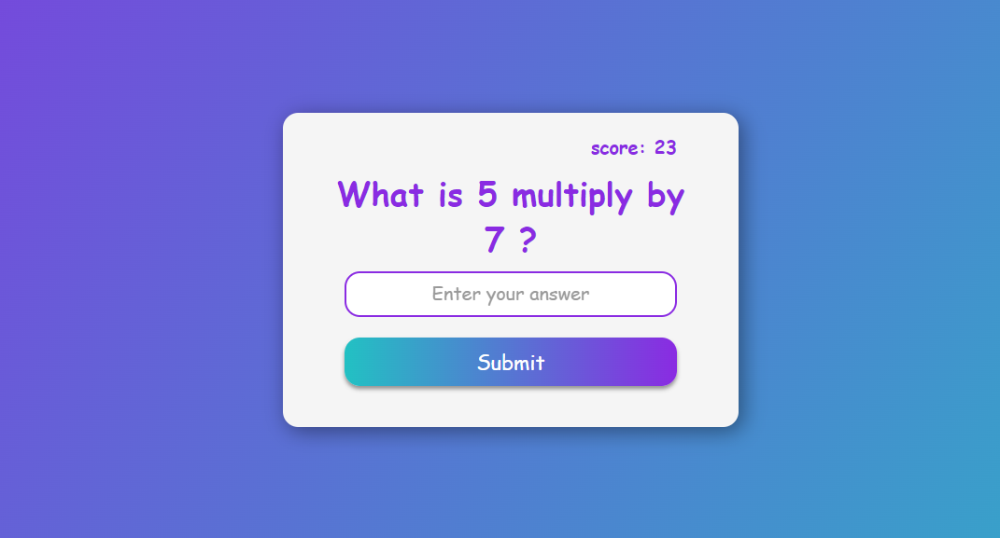

# App de multiplicação

## Visão Geral

### Projeto de uma aplicação Web que funciona como um jogo interativo de tabuada, onde os valores são gerados de forma aleatória e o usuário tenta acertar a multiplicação dos valores.
#




#
## Construido com:
- HTML
- CSS
- JavaScript

## Funcionalidades
- Essa aplicação funciona como um jogo interativo, onde o usuário lê a pergunta e tenta acertar a resposta. Se acertar, ganha pontos, e se errar perde pontos.

## O que eu aprendi:
- Manipulação do DOM
- Armazenar dados da página no navegador
```js
  function updateLocalStorage () {
  localStorage.setItem('score', JSON.stringify(score));
}
```
- Função Math.ceil e Math.random
```js
  const num1 = Math.ceil(Math.random()*10)
```
- Usar a propriedade innerText para pegar o texto de um elemento HTML
 ```js
  scoreEl.innerText = `score: ${score}`
```

## Link

Veja o projeto funcionando aqui: [Acessar🌍](https://devhiderlan.github.io/multiplication-app/) 

## Autor

Hiderlan Santana: [Linkedin](https://www.linkedin.com/in/hiderlan-santana/)